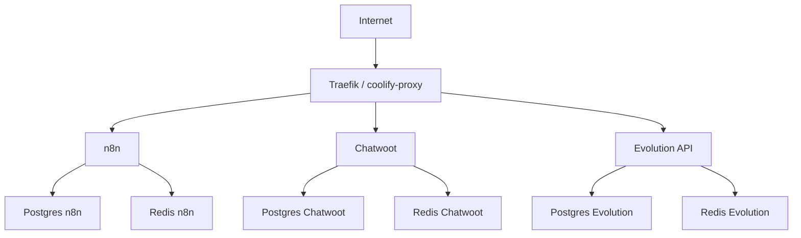
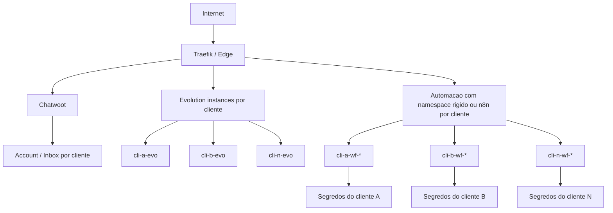

# Architecture

## Visao logica atual



## Visao logica recomendada para 10 clientes



## Responsabilidades

- `Traefik / coolify-proxy`: roteamento HTTP/HTTPS e certificados
- `n8n`: automacoes, workflows e integracoes de negocio
- `Chatwoot`: inbox/atendimento
- `Evolution API`: integracao WhatsApp/API
- `Postgres` e `Redis`: persistencia e fila por stack

## Estado atual da arquitetura

Pontos fortes:

- `n8n`, `Chatwoot` e `Evolution` ja operam em dominios proprios
- `api.elevalocal.shop` ja foi consolidado em HTTPS
- `Coolify` saiu da internet publica
- restore drill dos tres stacks ja foi validado

Pontos de atencao:

- a arquitetura ainda nasceu como stack operacional unica, nao como plataforma multi-tenant nativa
- o maior risco atual nao e uptime; e cross-tenant
- `n8n` segue sendo a camada de maior blast radius

## Risco arquitetural principal

Para 10 clientes, o ponto critico deixa de ser "como subir o servico" e passa a ser "como impedir mistura entre clientes".

Os riscos mais relevantes sao:

- workflow do cliente A executando com credenciais do cliente B
- inbox do cliente errado recebendo trafego
- agente/IA/prompt errado processando conversa
- restore de stack afetando mais de um cliente
- naming inconsistente escondendo ownership real

## Ponto critico historico identificado

O `n8n` foi criado por template gerado do Coolify. Nesse template, o compose continha:

```yaml
N8N_EDITOR_BASE_URL: '${SERVICE_URL_N8N}'
WEBHOOK_URL: '${SERVICE_URL_N8N}'
N8N_HOST: '${SERVICE_URL_N8N}'
```

Para `n8n` atras de proxy reverso, isso estava parcialmente errado:

- `N8N_EDITOR_BASE_URL`: pode usar URL completa
- `WEBHOOK_URL`: pode usar URL completa
- `N8N_HOST`: deve ser apenas o hostname

Esse mesmo historico reforca uma regra maior: templates compartilhados e defaults automativos aumentam risco de drift operacional e devem ser minimizados antes de escalar clientes.

## Restricao operacional confirmada

O stack atual do `n8n` deve permanecer em compatibilidade com `redis:7-alpine`.

Motivo:

- uma tentativa de cutover usou Redis 7 no volume existente
- o rollback para Redis 6 falhou por incompatibilidade de formato RDB
- conclusao: rollback e operacao atual devem considerar Redis 7 como baseline

## Arquitetura recomendada de isolamento

### Recomendado

- `1 Evolution instance por cliente`
- `1 inbox Chatwoot por cliente`
- `1 conjunto de segredos por cliente`
- `1 namespace obrigatorio por cliente em workflows`
- idealmente `1 n8n por cliente`

### Minimo aceitavel

Se o `n8n` continuar compartilhado por algum periodo:

- prefixo obrigatorio por cliente em workflows
- credenciais segregadas por cliente
- naming padrao por tenant
- ownership explicito por secret e fluxo
- checklist de revisao antes de publicar alteracoes

## Decisao recomendada

A arquitetura deve evoluir em duas frentes:

1. manter a stack atual estavel
2. introduzir fronteiras por cliente antes de escalar para 10 contas

Isso implica:

- inventario por tenant
- naming padrao
- separacao de credenciais
- separacao de inboxes e instancias
- revisao da estrategia final do `n8n`

## Proximas decisoes arquiteturais

- decidir se o `n8n` final sera por cliente ou compartilhado com namespace rigido
- formalizar o boundary por cliente em `Chatwoot`
- formalizar o boundary por cliente em `Evolution`
- alinhar backup e restore para reduzir blast radius por tenant
